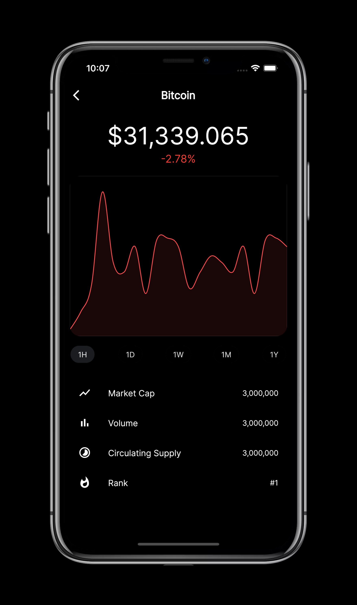

# Flutter Crypto Listing App

## A simple app for showing crypocurrencies and their prices using the [**Nomics API**](https://nomics.com/docs).
 

## 📸 ScreenShots

| List of Currencies | Currency Details |
|------|-------|
|||

## 🔌 Plugins
| Name | Usage |
|------|-------|
|[**Riverpod**](https://riverpod.dev)| State Management|
|[**Fl Chat**](https//pub.dev/packages/fl_chart)| Chart Library|

## 🤓 Author(s)
**Chisom Ekwuribe** 

